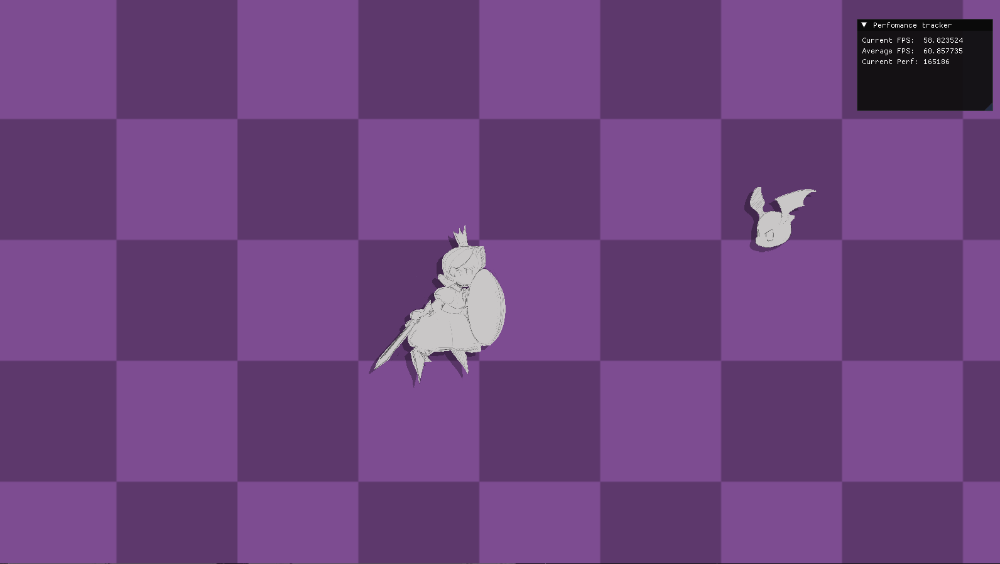

# Project-Stag

## Game Engine from Scratch Project   
This is a 2D game engine for a game idea I had I called "S.T.A.G" or Sword To A Gunfight. A horizontal (yoko) "Shoot 'em up" where all you have just a sword and a shield.    


## Features
* Game Loop
* Sprite Rendering
* Dropshadow
* ImGui Implementation
* Performance Tracker
* Makefile Compiler

## WIP features
* AABB Collision
* Frame by Frame animation

## How to Run
Run make file
```
.\build\main.exe
```
